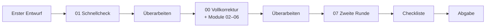

# 🔍 Kritische Korrektur

Prompts, Checklisten und ein Bewertungsraster, mit denen eine KI (ChatGPT, Claude, Gemini, Copilot …) jede Hochschularbeit so streng begutachtet wie eine anspruchsvolle Prüfer:in – **bevor** du abgibst.

Fach- und zitierstilunabhängig: Hausarbeit, Essay, Bericht, Fallstudie, Exposé, Abschlussarbeit, Präsentationstext.

## Schnellstart

1. Öffne [`prompts/00_vollkorrektur.md`](prompts/00_vollkorrektur.md) und kopiere den Prompt (Kopier-Symbol oben rechts im grauen Kasten).
2. Füge ihn in einen **neuen** Chat ein und fülle den Kontextblock aus – vor allem die Aufgabenstellung, wörtlich.
3. Hänge deine Arbeit als PDF oder DOCX an oder füge den Text am Ende ein.

## Was ist drin?

| Datei | Was sie liefert | Wann |
|---|---|---|
| [00_vollkorrektur](prompts/00_vollkorrektur.md) | Komplettes Gutachten: Notenschätzung, alle Befunde nach Schweregrad, Sprachfehler, Raster, Überarbeitungsplan | Arbeit ist weitgehend fertig |
| [01_schnellcheck](prompts/01_schnellcheck.md) | Die fünf größten Baustellen in wenigen Minuten | Erster Entwurf |
| [02_struktur_und_argumentation](prompts/02_struktur_und_argumentation.md) | Reverse Outline, Logik, roter Faden, Einleitung ↔ Fazit | Gliederung oder Argumentation wackelt |
| [03_quellen_und_zitation](prompts/03_quellen_und_zitation.md) | Fehlende Belege, Zitate, Abgleich mit dem Literaturverzeichnis, Quellenqualität | Vor der Abgabe |
| [04_sprache_und_stil](prompts/04_sprache_und_stil.md) | Fehlertabelle und wiederkehrende Stilmuster | Letzter Schliff |
| [05_abgleich_aufgabenstellung](prompts/05_abgleich_aufgabenstellung.md) | Jede Anforderung und jedes Bewertungskriterium einzeln abgehakt | Immer sinnvoll |
| [06_advocatus_diaboli](prompts/06_advocatus_diaboli.md) | Stärkste Einwände, versteckte Annahmen, Prüfungsfragen | Vor Kolloquium oder Präsentation |
| [07_zweite_runde](prompts/07_zweite_runde.md) | Prüft, ob die Befunde wirklich behoben sind | Nach der Überarbeitung |
| [08_lange_arbeiten_in_teilen](prompts/08_lange_arbeiten_in_teilen.md) | Ablauf für Texte, die zu lang für einen Chat sind | Bei Bedarf |
| [Checkliste vor der Abgabe](checklisten/vor_der_abgabe.md) | Abhakliste für dich selbst | Am Abgabetag |
| [Bewertungsraster](referenz/bewertungsraster.md) | Kriterien, Gewichtung, Beschreibung der Notenstufen | Zum Nachlesen oder Mitschicken |
| [Zitierstile](referenz/zitierstile_kurzreferenz.md) | APA, Harvard und deutsche Zitierweise im Überblick | Wenn der Stil wechselt |

## Empfohlener Ablauf

Mehr Tipps, Nachfrage-Prompts und die Grenzen von KI-Korrektur stehen in der [Anleitung](ANLEITUNG.md).

## Wichtig

- KI-Feedback ersetzt keine Betreuung. Die Notenschätzung ist Orientierung, keine Prognose.
- Die KI kann nicht prüfen, ob ein Zitat wirklich auf Seite 47 steht. Das musst du selbst tun.
- Die Prompts sind bewusst so gebaut, dass die KI **kritisiert und erklärt, aber nicht umschreibt**. Prüfe trotzdem die Regeln deines Kurses zur KI-Nutzung – manche verlangen eine Angabe, auch wenn du KI nur für Feedback nutzt.
